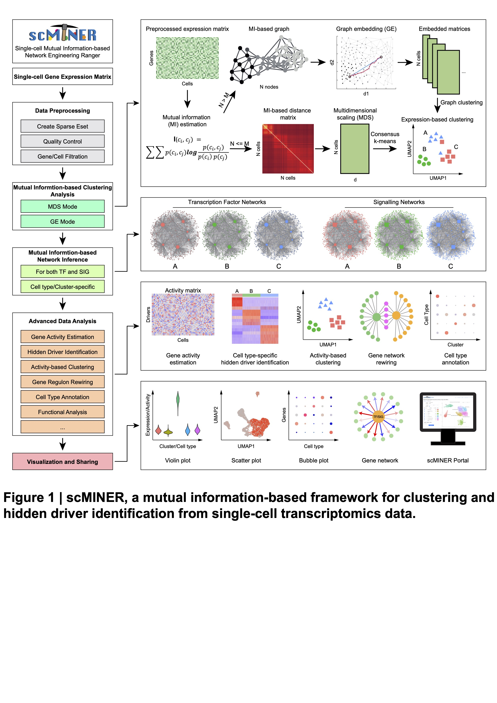

--- 
title: "scMINER: a mutual information-based framework for identifying hidden drivers from single-cell omics data"
author: "Qingfei Pan"
date: "`r Sys.Date()`"
knit: bookdown::render_book
site: bookdown::bookdown_site
documentclass: krantz
description: "This is the full documentation of scMINER R package (v-1.1.0)."
biblio-style: apalike
link-citations: yes
colorlinks: yes
lot: yes
lof: yes
fontsize: 12pt
monofont: "Source Code Pro"
monofontoptions: "scale=0.7"
github-repo: jyyulab/scMINER_documentation
---

#  {-}

---

Welcome to scMINER documentation!

**scMINER** (**s**ingle-**c**ell **M**utual **I**nformation-based **N**etwork **E**ngineering **R**anger) is a computational framework designed for **end-to-end** analysis of single cell RNA-seq data. Using [**mutual information**](https://en.wikipedia.org/wiki/Mutual_information) to measure cell-cell similarities and gene-gene correlations, scMINER is widely applicable and highly accurate in unsupervised clustering and gene activity inference of scRNA-seq data.

In this documentation, we will walk you through every analysis that scMINER can do and introduce you more about the concepts related to scMINER framework.

